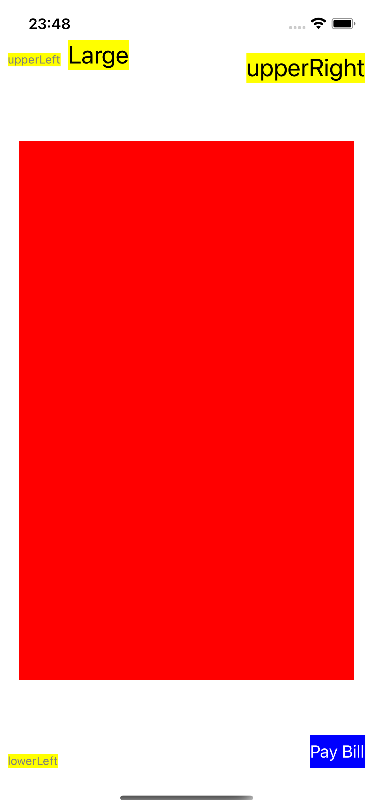
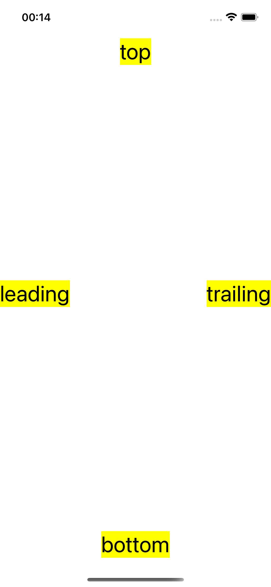
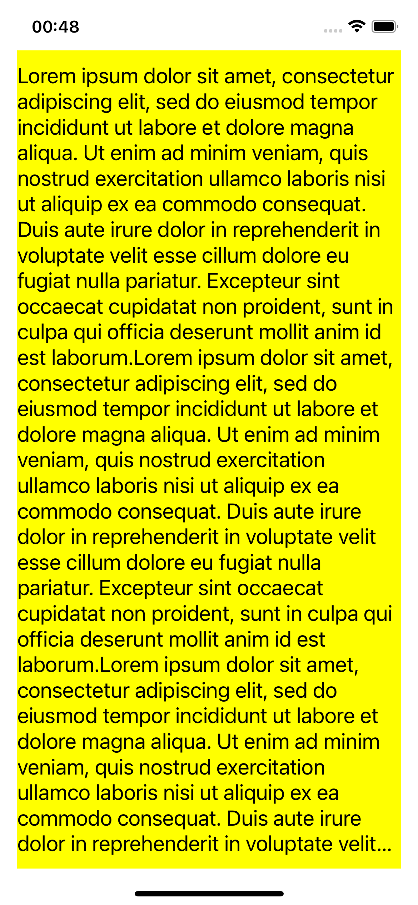
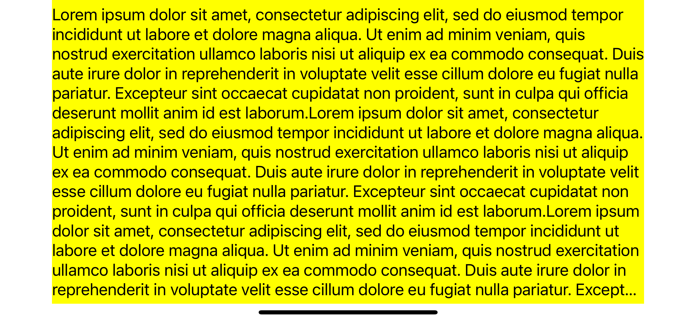
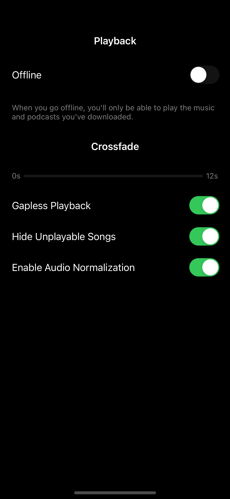

# Anchors

## Googleable Terms

Anchors, Constraints, Auto Layout, Layout Guides, SafeAreaGuides, Layout Margins, ReadableContent Guides

## Links

[Anchors](https://developer.apple.com/documentation/uikit/uiview/1622520-leadinganchor)

[Auto Layout Guide](https://developer.apple.com/library/archive/documentation/UserExperience/Conceptual/AutolayoutPG/)

[Anatomy of a Constraint](https://developer.apple.com/library/archive/documentation/UserExperience/Conceptual/AutolayoutPG/AnatomyofaConstraint.html#//apple_ref/doc/uid/TP40010853-CH9-SW1)

[Layout Guides](https://developer.apple.com/documentation/uikit/uilayoutguide)

[The Original Scientific Paper Upon Which Auto Layout is based](https://constraints.cs.washington.edu/solvers/cassowary-tochi.pdf)

## Gotchas

Set `translatesAutoresizingMaskIntoConstraints = false` on every view

Ensure all constraints are active i.e. `.isActive = true`

Add your subviews to the the view i.e. `addSubview(thumbnailImageView)`

#### 01.Anchors Lab

#### 02.Safe Area Lab

#### 03.Margin Guide Lab

#### 04.Margin Guide Spacer View Lab

#### 05.Challenge

