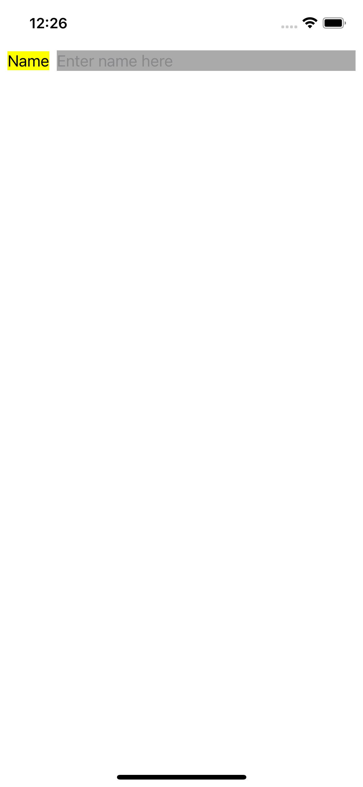

# Intrinsic Content Size

## Googleable Terms

Intrinsic Content Size, Content Hugging, Compression Resistance, Priorities

## Links

[Views with Intrinsic Content Size](https://developer.apple.com/library/archive/documentation/UserExperience/Conceptual/AutolayoutPG/ViewswithIntrinsicContentSize.html)

[Intrinsic Content Size](https://developer.apple.com/library/archive/documentation/UserExperience/Conceptual/AutolayoutPG/AnatomyofaConstraint.html#//apple_ref/doc/uid/TP40010853-CH9-SW21)

[intrinsicContentSize](https://developer.apple.com/documentation/uikit/uiview/1622600-intrinsiccontentsize)

[invalidateIntrinsicContentSize()](https://developer.apple.com/documentation/uikit/uiview/1622457-invalidateintrinsiccontentsize)

[UILayoutPriority](https://developer.apple.com/documentation/uikit/uilayoutpriority)

## Gotchas

Allows controls to lay themselves out without requiring full constraints

CHCR is how we resolve ambiguity

Constraints have priorities

#### 01.Intrinsic Content Size

#### 02.Content Hugging Compression Resistance

#### 03.CHCR with Image

#### 04.Challenge.png

